# From Scripts to Screen: Building a Screenplay Analysis Pipeline with Airflow, NLP, and PostgreSQL

## Introduction

In film studies and production analysis, understanding how dialogue evolves from screenplay to final film provides critical insights into the creative process. This article details an end-to-end data engineering solution that automatically extracts, processes, and analyzes the journey of dialogue from page to screen.

The **ScreenplaysNLP** project demonstrates how modern data engineering principles can transform unstructured screenplay and subtitle text into structured analytical datasets, integrating web scraping, natural language processing, and database technologies within an orchestrated workflow.

## Architecture Overview



The system is built on four main components:

1. **Data Acquisition Layer**: Web scraping handling dynamic content to extract and preprocess movie script and subtitles (different formats).
2. **Processing Layer**: NLP-based text normalization, similarity analysis, topic extraction, and pattern discovery.
3. **Storage Layer**: PostgreSQL database optimized for dialogue comparison queries.
4. **Orchestration Framework**: Apache Airflow DAG managing the entire workflow.

## Extract: Data Acquisition Strategy

### Web Scraping Infrastructure

The system implements a resilient web scraping approach to handle the complexities of screenplay websites:

```python
def setup_scraping_environment() -> webdriver:
	"""Configure scraping environment with reliability features."""
	options = webdriver.FirefoxOptions()
	options.headless = True
	options.add_argument("--no-sandbox")
	
	# Create browser profile with anti-detection measures
	profile = webdriver.FirefoxProfile()
	profile.set_preference("javascript.enabled", True)
	
	driver = webdriver.Firefox(options=options, firefox_profile=profile)
	driver.set_page_load_timeout(30)
	driver.implicitly_wait(10)
	return driver
```

The `find_and_click_download_buttons` function implements a resilient web scraping approach by recursively searching for potential download elements using multiple selector strategies, maintaining state across navigation contexts, gracefully handling failures, and systematically exploring the DOM until a successful download is detected:

```python
def find_and_click_download_buttons(self, driver:webdriver, max_depth:int=2, current_depth:int=0, visited_elements:int=None) -> bool:
		"""Recursively find and click potential download buttons until a download starts."""
		if visited_elements is None:
			visited_elements = set()
			
		if current_depth >= max_depth:
			logging.info(f"Reached maximum recursion depth ({max_depth})")
			return False
		
		# Find all potential download buttons
		potential_buttons = []
		
		# By ID 
		button_ids = [
			'download-en',
			'btn-download-subtitle', 
			'downloadButton',
			'bt-dwl-bt', 
			'bt-dwl', 
			'download-tigger', 
			'download-button', 
			'dl-button'
		]
		for button_id in button_ids:
			try:
				elements = driver.find_elements(By.ID, button_id)
				if elements:
					potential_buttons.extend(elements)
			except Exception:
				pass
		
		# ...
		
		# Try clicking each button
		for i, (button, sig) in enumerate(new_buttons):
			try:
				# Log button info
				button_text = button.text.strip() if button.text else "[No text]"
				button_href = button.get_attribute('href') if button.get_attribute('href') else "[No href]"
				
				# Ensure element is visible
				driver.execute_script("arguments[0].scrollIntoView(true);", button)
				time.sleep(0.5)
				
				# Click the button
				driver.execute_script("arguments[0].click();", button)
				logging.info(f"Clicked button {i+1}/{len(new_buttons)}")
				
				# Check if download started
				start_time = time.time()
				while time.time() - start_time < 5:  # 5 second check
					if any(file.endswith(('.zip', '.srt')) for file in os.listdir(self.staging_dir)):
						logging.info(f"Download started after clicking button at depth {current_depth}")
						return True
					time.sleep(0.5)
				
				# Check for new windows/tabs
				if len(driver.window_handles) > 1:
					# Switch to new window
					driver.switch_to.window(driver.window_handles[-1])
					
					# Recursive call in new window
					if self.find_and_click_download_buttons(driver, max_depth, current_depth + 1, visited_elements):
						return True
					
					# Close and switch back if no download
					driver.close()
					driver.switch_to.window(driver.window_handles[0])
				else:
					# Try recursively on same page (new elements might have appeared)
					if self.find_and_click_download_buttons(driver, max_depth, current_depth + 1, visited_elements):
						return True
```

The acquisition layer handles multiple challenges:

- **Dynamic Content**: Selenium WebDriver navigates JavaScript-heavy sites.
- **Anti-Scraping Countermeasures**: User-agent rotation and session management.
- **Content Structure Variations**: Flexible selector patterns adapt to different screenplay formats.
- **Failure Resilience**: Exponential backoff retry logic handles transient errors.

### Processing Engine

Alongside screenplay text, the system extracts and processes subtitle file to align film dialogue with timestamps and parts:

```python
	def align(self) -> pd.DataFrame:
		"""Align subtitles and script dialogues based on text similarity."""
		df_srt = self.extract_srt()
		df_script = self.extract_script()
		
		matches = []
		matched_script_indices = set()  
		last_match_idx = 0  
		window_size = 10
		
		# For each subtitle dialogue, find best matching script dialogue
		for i, srt_row in df_srt.iterrows():			
			best_match = None
			best_score = CONFIG['SIMILARITY_THRESHOLD']
			
			# Define search window (centered around last position)
			window_start = max(0, last_match_idx - window_size//4)  
			window_end = min(len(df_script), last_match_idx + window_size) 
			
			# Search within window and not yet matched
			for j in range(window_start, window_end):
				if j in matched_script_indices:
					continue 
					
				score = Toolbox.jaccard_similarity(srt_row['dialogue'], df_script.loc[j, 'dialogue'])
				if score > best_score:
					best_score = score
					best_match = j
			
			if best_match is not None:
				matched_script_indices.add(best_match)  
				last_match_idx = best_match + 1 
				
				matches.append({
					'timecode': srt_row['timecode'],
					'part': df_script.loc[best_match, 'part'],
					'srt_dialogue': srt_row['dialogue'],
					'script_dialogue': df_script.loc[best_match, 'dialogue'],
					'similarity': best_score
				})
		
		# Sort by timecode to maintain chronological order
		result_df = pd.DataFrame(matches)

		return pd.DataFrame(matches)
```

This approach ensures accurate time and role alignment between screenplay and film dialogue.

## Transform: Text Processing Pipeline
The NLP processing pipeline implements advanced topic modeling and deep learning approaches to analyze screenplay dialogue patterns.
Our processing pipeline incorporates three sophisticated techniques:

1. **Parameter Estimation for LDA**: The system automatically determines optimal hyperparameters (max features, alpha and eta priors, etc.) and topic count by evaluating model coherence across parameter combinations: 
```python
def estimate_best_params(self) -> Dict[str, Any]:
    """Estimate the best parameters for the topic extraction model using grid search."""    
    # Define pipeline
    pipeline = Pipeline([
        ('vectorize', CountVectorizer(
            analyzer='word',
            stop_words='english',
            max_df=0.95, min_df=2
        )),
        ('reduce_dim', LatentDirichletAllocation(
            batch_size=150,
            learning_method='online',
            learning_offset=15,
            random_state=0,
            evaluate_every=1,
            n_jobs=-1
        ))
    ])
    
    params_grid = {
        'vectorize__max_features': (int(self.n_features*0.75), self.n_features),
        'vectorize__ngram_range': ((1,1), (1,2)),
        'reduce_dim__n_components': ([6, 8, 10]),
        'reduce_dim__max_iter': (int(self.n_features*0.75), self.n_features)
    }
```

2. **Latent Dirichlet Allocation for Unsupervised Topic Extraction**
```python
def factor(self) -> bool:
    """Apply topic modeling to extract topics from text data."""
        # Fit the model
        self.model.fit(self.data)
        
        # Predict the labels
        try:
            if hasattr(self.model, 'predict'):
                self.labels = self.model.predict(self.data)
            elif hasattr(self.model, 'transform'):
                self.labels = self.model.transform(self.data).argmax(axis=1)
```
3. **LSTM Networks for Pattern Discovery**: Uses GloVe embeddings and trains on the predicted topics.
```python
# Create LSTM model
model = Sequential([
    Embedding(
        input_dim=vocab_size,
        output_dim=embedding_dim,
        input_length=input_length,
        weights=[embedding_matrix] if embedding_matrix is not None else None,
        trainable=True,
        name='embeddings'
    ),
    LSTM(64, return_sequences=True),
    LSTM(32),
    Dropout(0.3),
    Dense(20, activation='relu'),
    Dense(n_topics, activation='softmax')
])
```
This sophisticated approach enables:
- Automatic discovery of thematic patterns across screenplay dialogue
- Identification of topic evolution from screenplay to film
- Character-specific topic analysis revealing storytelling patterns

The resulting models provide valuable insights into how dialogue themes evolve from script to screen, revealing both intentional revisions and emergent narrative patterns.


## Load: Database Design Philosophy

The PostgreSQL database implements a schema optimized for dialogue comparison and analysis:

```sql
CREATE TABLE screenplay(
    id INT PRIMARY KEY,
    timecode TEXT,
    part TEXT,
    script_text TEXT NOT NULL,
    subtitle_text TEXT,
    similarity_score FLOAT,
	topic_label	INT,
	topic_topwords TEXT
);
```

This schema design enables efficient:
- Dialogue retrieval by timestamp or part.
- Full-text search across dialogue content.
- Similarity or predicted label based filtering and analysis.

## Workflow Orchestration with Airflow

The entire pipeline is managed through an Apache Airflow DAG that handles dependencies, scheduling, and error recovery:

```python
with DAG(
    dag_id="ScreenplaysNLP_pipeline",
    default_args={
        "owner": "Bar0cc0",
        "retries": 3,
        "retry_delay": timedelta(minutes=5),
        "email_on_failure": True
    },
    description="ETL pipeline for screenplay dialogue analysis",
    schedule_interval=None,
    catchup=False
) as dag:
    # ...

def check_extract_success(**context):
	task_instance = context['ti']
	extract_tasks = task_instance.xcom_pull(task_ids=['extract.run_extract_script'])
	return all(result is not None for result in extract_tasks)

def check_load_success(**context):
	task_instance = context['ti']
	load_tasks = task_instance.xcom_pull(task_ids=['load'])
	return all(result is not None for result in load_tasks)
```

This orchestration provides:
- Task dependency management.
- Automatic retries for transient failures.
- Cross-component data exchange via XCom.
- Monitoring and alerting capabilities.

## Containerized Deployment

The pipeline runs in a multi-container Docker environment that ensures consistency across development and production environments. This containerized architecture provides several key advantages:

```yaml
services:
  postgres:
    image: postgres:13
    environment:
      - POSTGRES_USER=airflow
      - POSTGRES_PASSWORD=airflow
    volumes:
      - postgres-db-volume:/var/lib/postgresql/data
      - ./init-postgres.sql:/docker-entrypoint-initdb.d/init-postgres.sql

  airflow:
    build: .
    volumes:
      - ./scripts:/opt/airflow/ScreenplaysNLP/Scripts
      - ./data:/opt/airflow/ScreenplaysNLP/Data
      - ./Rflow.py:/opt/airflow/dags/Rflow.py
      - ./logs:/opt/airflow/logs
```

The architecture features:

1. **Separation of Concerns**: The PostgreSQL database runs in its own container, while Airflow manages workflow orchestration in another.

2. **Dynamic Development**: Volume mounting allows for rapid iteration without rebuilding containers when modifying scripts, DAGs, or data files.

3. **Web Scraping Enablement**: The Airflow container includes Firefox, Geckodriver, and Xvfb for headless browser automation:

   ```dockerfile
   # Install system dependencies
   RUN apt-get update && apt-get install -y --no-install-recommends \
       firefox-esr \
       xvfb \
       && apt-get clean && rm -rf /var/lib/apt/lists/*

   # Install latest geckodriver
   RUN wget https://github.com/mozilla/geckodriver/releases/download/v0.36.0/geckodriver-v0.36.0-linux64.tar.gz && \
       tar -xvzf geckodriver-v0.36.0-linux64.tar.gz && \
       mv geckodriver /usr/local/bin/
   ```

4. **Environment Configuration**: Environment variables configure database connections and Airflow settings, making the deployment adaptable to different environments without code changes.

5. **Data Persistence**: Named volumes ensure database state persists across container restarts, while mounted directories facilitate data exchange between the host and containers.

This containerization approach significantly simplifies deployment while addressing several technical challenges, including Selenium-based web scraping dependencies, database connectivity, and filesystem access for data processing.

## Engineering Challenges and Solutions

### Challenge 1: Web Scraping Reliability

**Problem**: Screenplay websites frequently change their structure and implement anti-scraping measures.

**Solution**: Implemented a multi-layer resilience strategy:
- Multiple selector patterns for content extraction.
- User-agent rotation and request throttling.
- Exponential backoff for transient errors.
- Content validation to verify extracted text quality.
- Firefox installation and Selenium errors are captured and reported

### Challenge 2: Dialogue Alignment

**Problem**: Matching screenplay dialogue to film subtitles is complex due to rewrites, cuts, and rearrangements.

**Solution**: Created a specialized alignment algorithm:
- Time-based primary matching for subtitle segments.
- Semantic similarity as secondary matching criteria.
- Sliding window approach to handle dialogue reordering.
- Fuzzy matching for minor text variations.

### Challenge 3: Performance Optimizations

**Problem**: High time complexity algorithms (grid search) and data volume.

**Solution**: Several techniques improve pipeline efficiency:
- Dialogue Alignment Window: Using a sliding window improves matching speed without sacrificing accuracy
- LDA Parameter Tuning: Grid search identifies optimal parameters faster than exhaustive search
- Batch Processing: Database operations use batch inserts for better throughput

### Challenge 4: Pipeline Resilience

**Problem**: Multiple dependencies (web access, NLP processing, database connectivity) create numerous failure points.

**Solution**: Comprehensive error handling strategy:
- Task-specific retry policies in Airflow.
- Database connection issues are handled implementing an automatic fallback strategy.
- Transaction-based database operations with schema validation before database insertion to prevent malformed records.
- Validation checkpoints between pipeline stages.
- Detailed logging for failure investigation.

## Key Findings

Analysis of "Back to the Future" revealed several interesting patterns:

1. **Topic Distribution**: LDA identified 6 distinct topic clusters across the screenplay dialogue, with themes of "family," "time travel," and "teenage anxiety" being most prominent.

2. **Dialogue Evolution**: Our LSTM model detected significant thematic shifts between screenplay and film versions, particularly in exposition scenes where complex concepts were simplified. 

	| Metric | Script | Final Film | Change |
	|--------|--------|------------|--------|
	| Dialogue Lines | 842 | 763 | -9.4% |
	| Unique Words | 4,291 | 3,872 | -9.8% |
	| Avg Words/Line | 12.3 | 9.7 | -21.1% |

3. **Character Analysis**: Topic modeling revealed distinctive linguistic patterns for each character:
   - Doc Brown's dialogue centered primarily on technical topics
   - Marty's dialogue showed the highest topic diversity
   - George McFly exhibited the most significant topic shift from screenplay to screen

4. **Temporal Patterns**: The LSTM model identified a consistent pattern where dialogue in action sequences was shortened by an average of 23% in the final film.

These findings demonstrate how combining LDA and deep learning techniques provides unique analytical insights into screenplay-to-film transformations.


## Implementation Best Practices

### Overview
The project demonstrates several engineering best practices:

- **Modular Design**: Code organization by function (extraction, processing, storage)
- **Idempotent Operations**: Tasks can be safely retried without side effects
- **Configuration Management**: Enables environment adaptation
- **Logging Strategy**: Comprehensive logging at all processing stages
- **Error Handling**: Graceful failure recovery with informative messages
- **Testing Approach**: Validation at component boundaries

### Object-Oriented Design

The ScreenplaysNLP project demonstrates advanced object-oriented programming principles throughout its codebase. The architecture leverages several design patterns to create a modular, maintainable, and extensible framework for ETL operations. 

#### Interface-Based Design with Abstract Base Classes

The foundation of the task creation system is the `ITask` abstract base class:

```python
class ITask(ABC):
    """Interface for task creation."""
    @abstractmethod
    def create_task(self, name:str, context:Optional[ConnectPSQL]=None, config:Optional[dict]=None, **kwargs) -> Any:
        raise NotImplementedError("Method not implemented")
```

This interface enforces a contract that all task implementations must follow, creating a consistent API across different task types. Each task type is then implemented as a concrete strategy for creating Airflow operators, allowing:
- Task-specific implementation details to be encapsulated
- New task types to be added without changing existing code
- Common validation and error handling to be reused

#### The Factory Pattern Implementation

The `TaskFactory` class is a sophisticated implementation of the Factory Method pattern:

```python
class TaskFactory:
    """Factory for task creation."""
    _instance:object = None
    _task_types:dict = {
                "bash": BashTask(),
                "sql": SQLTask(),
                "python": PythonTask(),
                "short_circuit": ShortCircuitTask(),
                "file_sensor": FileSensorTask()
            }
	# ... initialization code ...
    
    @classmethod
    def register_task_type(cls, type_name:str, implementation:ITask) -> None:
        cls._task_types[type_name] = implementation

    @classmethod
    def create_task(cls, task_type:str, name:str, **kwargs) -> object:
        task = cls._task_types.get(task_type)
        if not task:
            raise ValueError(f"Invalid task type: {task_type}")
        if not name:
            raise ValueError(f"No task name provided for task type {task_type}.")
        return task.create_task(name, **kwargs)
```

This factory provides:
- Dynamic task type registration
- Centralized task creation
- Consistent error handling
- Extensibility without modifying client code

#### Singleton Pattern for Connection Management

The `ConnectPSQL` class uses the Singleton pattern to ensure only one database connection object exists:

```python
class ConnectPSQL:
    _instance = None

    def __init__(self, conn_id):
        self.conn_id = conn_id or "postgres_default"
        # ... initialization code ...
    
    def __new__(cls, conn_id=None):
        if cls._instance is None:
            cls._instance = super().__new__(cls)
        return cls._instance
```

This prevents multiple database connections and provides a global access point while maintaining encapsulation.

### Advanced OOP Features in ModelDataset.py

The project's modeling components also demonstrate sophisticated OOP design:

- **Composition Over Inheritance**: Components like `TextProcessor`, `ModelHandler`, and `EmbeddingProvider` are composed together rather than extended
- **Custom Exception Hierarchy**: `ModelError`, `DataError`, and `ConfigError` create a specialized exception taxonomy
- **Dependency Injection**: Components receive their dependencies via constructors rather than creating them internally

### Benefits of This Approach

The object-oriented architecture provides several advantages:

1. **Testability**: Classes are isolated and can be tested independently
2. **Maintainability**: Each class has a clear, focused responsibility
3. **Extensibility**: New task types or processing components can be added with minimal changes
4. **Code Reuse**: Common functionality is shared through base classes and composition
5. **Error Handling**: Centralized error management ensures consistent responses
6. **Configuration Management**: Decoupled configuration from implementation details

The architecture enables the pipeline to evolve with new requirements while maintaining backward compatibility and code quality.

## Future Extensions

Future enhancements to this pipeline could include:

- Expanding to analyze scene descriptions
- Adding sentiment analysis to dialogue comparison
- Creating a visualization dashboard for insights
- Implementing a configuration service layer to improve adaptability


## Conclusion

The ScreenplaysNLP project demonstrates how modern data engineering techniques can transform unstructured textual content into structured, analyzable data. By combining web scraping, NLP, and database technologies within an orchestrated workflow, we've created a system that automatically extracts insights about the evolution of dialogue from screenplay to screen.

This architecture provides a template for similar text analysis workflows in fields like content analytics, sentiment analysis, and document comparison. The containerized approach ensures consistent deployment across environments, while the modular design enables extension to additional data sources and analytical techniques.

---
*This project was developed using Python 3.10, Apache Airflow 3.0, PostgreSQL, Selenium, Pandas, ScikiLearn, and TensorFlow.*